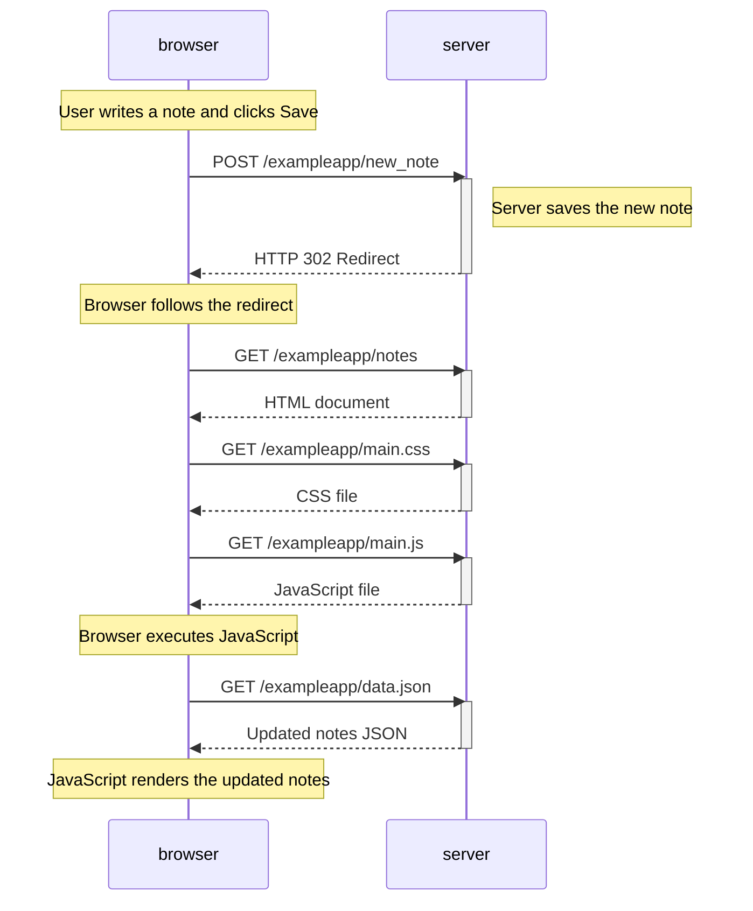
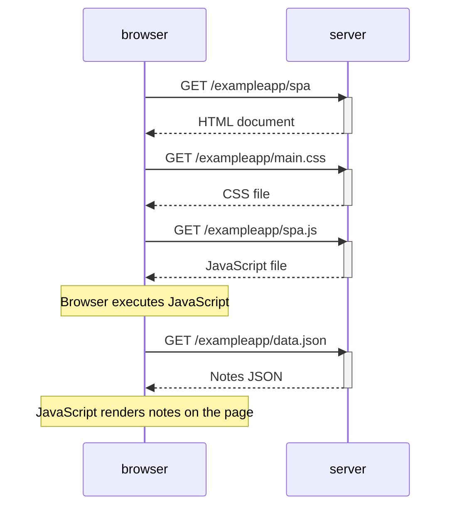
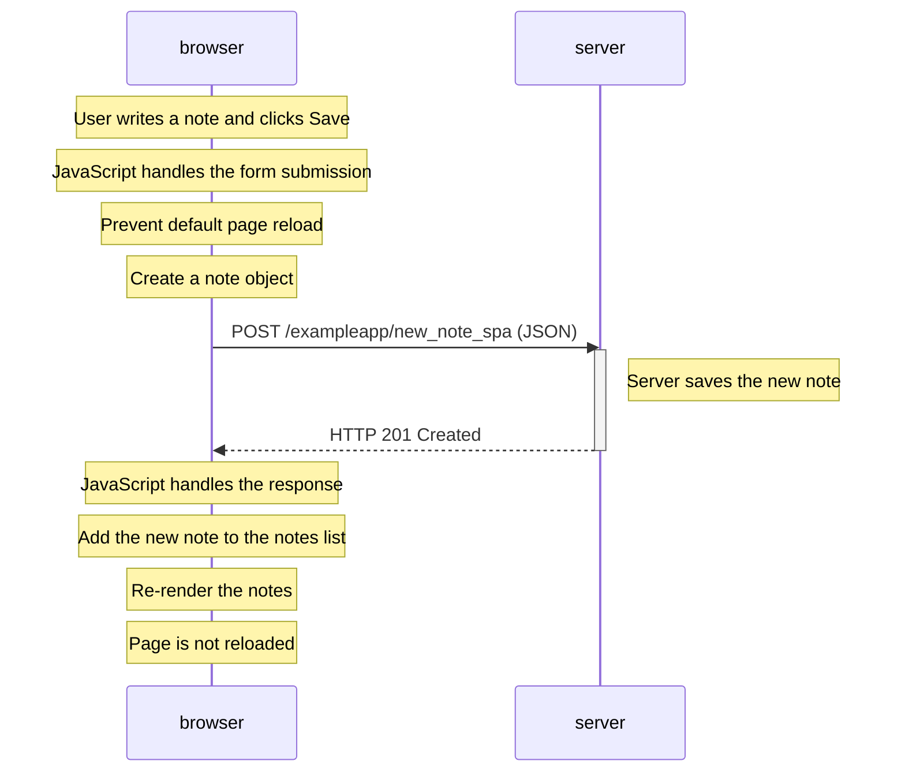

# Part 0 – Fundamentals of Web Apps

## 0.4: New Note Diagram

```mermaid
sequenceDiagram
    participant browser
    participant server

    Note over browser: User writes a note and clicks Save

    browser->>server: POST /exampleapp/new_note
    activate server
    Note right of server: Server saves the new note
    server-->>browser: HTTP 302 Redirect
    deactivate server

    Note over browser: Browser follows the redirect

    browser->>server: GET /exampleapp/notes
    activate server
    server-->>browser: HTML document
    deactivate server

    browser->>server: GET /exampleapp/main.css
    activate server
    server-->>browser: CSS file
    deactivate server

    browser->>server: GET /exampleapp/main.js
    activate server
    server-->>browser: JavaScript file
    deactivate server

    Note over browser: Browser executes JavaScript

    browser->>server: GET /exampleapp/data.json
    activate server
    server-->>browser: Updated notes JSON
    deactivate server

    Note over browser: JavaScript renders the updated notes
```

## 0.5: Single Page App Diagram

```mermaid
sequenceDiagram
    participant browser
    participant server

    browser->>server: GET /exampleapp/spa
    activate server
    server-->>browser: HTML document
    deactivate server

    browser->>server: GET /exampleapp/main.css
    activate server
    server-->>browser: CSS file
    deactivate server

    browser->>server: GET /exampleapp/spa.js
    activate server
    server-->>browser: JavaScript file
    deactivate server

    Note over browser: Browser executes JavaScript

    browser->>server: GET /exampleapp/data.json
    activate server
    server-->>browser: Notes JSON
    deactivate server

    Note over browser: JavaScript renders notes on the page
```

## 0.6: New Note in Single Page App Diagram

```mermaid
sequenceDiagram
    participant browser
    participant server

    Note over browser: User writes a note and clicks Save

    Note over browser: JavaScript handles the form submission
    Note over browser: Prevent default page reload
    Note over browser: Create a note object

    browser->>server: POST /exampleapp/new_note_spa (JSON)
    activate server
    Note right of server: Server saves the new note
    server-->>browser: HTTP 201 Created
    deactivate server

    Note over browser: JavaScript handles the response
    Note over browser: Add the new note to the notes list
    Note over browser: Re-render the notes

    Note over browser: Page is not reloaded
```

